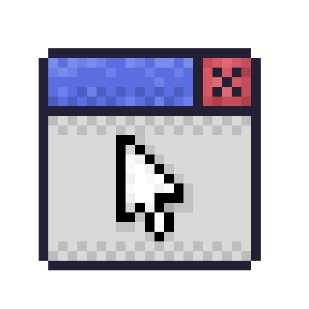

<p align="center">
    
</p>

# The Framework
The Orin Framework is a game framework written in C for maximum performance and portability.
I've taken some inspiration from SDL and RayLib to not make it extremely difficult nor lack
any low-level aspects of game development.

## Wrappers
The Orin Framework is also available for the following languages:
- [Python](./python/)


In future versions, I might wrap it to other languages such as:
- C++
- C#
- Java


## Features
- Display Management
- Texture Loading & Rendering
- Keyboard & Mouse Input
- Vector & Matrix Math
- Audio Support (coming soon)


## Dependencies
As of the latest version, the Orin Framework only relies in STB Image.


## Code Example
```c
/**
 * Orin Framework, 2025
 * Basic window example
 *
 * This program demonstrates on how to:
 * - Create a window
 * - Set up a camera and shader
 * - Render a rectangle centered in the center of the screen
 * - Basic keyboard and mouse input
 */

#include <orin.h>
#include <stdio.h>

int main() {
    // DisplayMode contains the width and the height of the screen
    DisplayMode displayMode = { 800, 600 };

    /**
     * CreateDisplay(DisplayMode, title, args)
     * Here, we are creating a 800 by 600 pixels display
     * called "Game", this window will be using OpenGL 3.3,
     * OpenGL 2.1 and 4.6 are also supported.
     */
    Display *display = CreateDisplay(displayMode, "Game", OPENGL_33);

    /**
     * This is a shader, the base of how rendering works in modern OpenGL
     * CreateDefaultShader() returns a basic shader with the intention of being
     * used for simple or prototype games, you can write your own shaders and
     * load them here using CreateShader(vertexFile, fragmentFile)
     */
    Shader *shader = CreateDefaultShader();

    /**
     * This is the camera, the essential component to follow the player and etc.
     * Contains basic properties for now since I haven't added 3D OpenGL yet.
     */
    Camera2D camera;
    camera.position = (Vector2f) { 0, 0 }; // Base (x: 0, y: 0) position
    camera.zoom = 1; // Zoom set to 1 (default)

    // Create rectangle position
    Vector2f position = { 0, 0 };

    // Game loop, while the display shouldn't close
    while (!DisplayShouldClose(display)) {
        // Clear the background buffer with red
        ClearBackground(RED);

        /**
         * When we press the down arrow key, the position will
         * shift 0.01 pixels per frame
         *
         * IsKeyDown(Key)
         * IsKeyReleased(Key)
         */
        if (IsKeyDown(KEY_DOWN)) {
            position.y += 0.01f;
        }

        /**
         * When we release the left mouse button, the position will
         * shift to the right by 100 pixels
         *
         * IsMouseButtonDown(Button)
         * IsMouseButtonReleased(Button)
         */
        if (IsButtonReleased(MOUSE_BUTTON_LEFT)) {
            position.x += 100.0f;
        }

        /**
         * BeginDrawing(Shader, Camera2D)
         * Needs a shader and a camera to properly work.
         */
        BeginDrawing(shader, camera);

        /**
         * Vector2f is a struct with two values
         * x: float
         * y: float
         */
        Vector2f size = { 64, 64 }; // Size is 64x64

        // Making the position centered on the display

        /**
         * DrawRectangle(Vector2f position, Vector2 size, Color color)
         * Draws the rectangle to the specified position and size
         * The transformation and color is later processed inside the shaders
         */
        DrawRectangle(position, size, WHITE);

        EndDrawing(); // End the drawing context

        // Swap the buffers and poll event the GLFW display
        UpdateDisplay(display);
    }

    // Clean up display resources and close the window
    DestroyDisplay(display);

    return 0;
}
```
