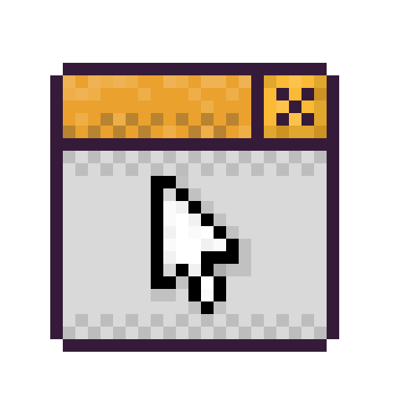

<p align="center">
    
</p>

# Orin Framework - Python Wrapper
This is the python wrapper available for the Orin Framework.
It's in its infancy, so don't expect it to perform similarly to the native version
especially since it's written in python.

Anyways, it basically wraps the whole framework into the python environment.

## Disclaimer
As of now, I can only provide the `.dylib` built Orin Framework dynamic library,
I will export a Windows x86 and x64, and Linux dynamic libraries later on.
As of now, you can simply download the Orin Framework (C) and built it yourself.

This wrapper will be receiving heavy changes in the next updates.

## Bugs
Please report it as an issue so I can fix it as soon as possible.

## Code Example
```python
'''
    Orin Framework, 2025

    What this example shows:
    - Display management
    - Texture loading & rendering
    - Handling input
    - Cleaning up resources
'''

# Import everything from the Orin Framework
from orin import *

# Create the display mode (width, height)
display_mode = DisplayMode(960, 540);

# Create the display (DisplayMode, title, args)
# This display is using OpenGL 3.3 as the back-end
display = CreateDisplay(display_mode, title="Yeah!", args=OPENGL_33)

# Create a base camera
camera = Camera2D()
# Set its position to x = 0, y = 0
camera.position = Vector2f(0, 0)
# Zoom = 1 (default)
camera.zoom = 1

# Create the default shader for rendering
shader = CreateDefaultShader()

# Load a texture and store it in memory, load it using nearest-neighbor
texture = LoadTexture("orin-framework.png", NEAREST)

# While the screen shouldn't close
while not DisplayShouldClose(display):
    ClearBackground(BLUE)

    # When key 'A' is pressed
    # There's also IsKeyReleased
    if IsKeyDown(KEY_A):
        print("Key A is down!")

    # When the user left click's
    # There's also IsButtonDown
    if IsButtonReleased(MOUSE_BUTTON_LEFT):
        print("Left button down!")

    # Begin the drawing context (Shader, Camera)
    BeginDrawing(shader, camera)
    
    # Draw a texture at position x = 100, y = 100, with the size of 64x64
    # And with the color RED
    DrawTexture(texture, Vector2f(100, 100), Vector2f(64, 64), RED);

    # End the drawing context
    EndDrawing()
    
    # Swap the buffers and poll event the GLFW back-end
    UpdateDisplay(display)

# Cleanup resources and terminate display
DestroyTexture(texture)
DestroyDisplay(display)
```
